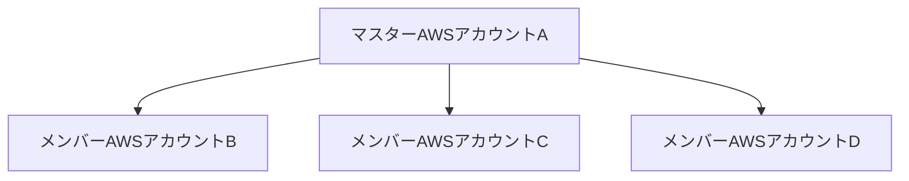

## AWS Organizations

複数 AWS アカウントを利用している時に統合管理できる。
IAM は AWS アカウント内のユーザーを管理しているが AWSOrganizations は複数 AWS アカウント自体を管理する。

- 一括請求
- 権限管理の一元化

| 機能                     | 説明                                                                           |
| ------------------------ | ------------------------------------------------------------------------------ |
| 複数アカウントの一元管理 | AWS アカウントをグループ化してポリシーを一元的に管理する                       |
| 新規アカウントの作成管理 | コンソール/SDK/CLI で AWS アカウントを新規作成して、作成内容をログ管理できる。 |
| 一活請求                 | 複数 AWS アカウントの請求を一括化する                                          |

### Organizations 選択

| 方式                      | 説明                                                                                                         |
| ------------------------- | ------------------------------------------------------------------------------------------------------------ |
| Consolidated Billing Only | 支払い代行のみ実施する場合に選択  ボリュームディスカウントを統合できるため、コストメリットが発生する。 |
| All Feature               | 支払一括代行も含めて、企業内の複数アカウントを統制したい場合に選択                                           |

### アカウント設定

- メンバーアカウントはマスターアカウントからの招待を承認するとメンバーアカウントととして登録される。
- メンバーアカウントから削除する際は独立したアカウントとして請求処理などを設定する必要がありましたが、コンソールから容易に削除できるようになった。

### SCP (Service Contorol Poliicy)

SCP というポリシーを利用して、　 OU（組織単位）内のメンバーに対して権限の境界を設定することが出来る。

|     | 権限    | 権限    | 権限 | 権限 |
| --- | ------- | ------- | ---- | ---- |
| IAM | **EC2** | **ECS** | RDS  | S3   |
| SCP | **EC2** | **ECS** |      |      |

上記表のように　 AWS アカウント内で IAM 権限を付与されていたとしても SCP 側で RDS と S3 の権限は許可されていないため実行権限の範囲は EC2 と ECS のみとなる。

以下２つの形式が存在する。

- ホワイトリスト形式(許可)
- ブラックリスト形式(拒否)

 

| 形式           | 権限 | 権限    | 権限 | 権限   |
| -------------- | ---- | ------- | ---- | ------ |
| ホワイトリスト | EC2  | **ECS** | RDS  | **S3** |
| ブラックリスト | EC2  |         | RDS  |        |

上記表のようにホワイトリスト形式に加えて、ブラックリスト形式の設定が追加されるとブラックリスト設定が優先され実行権限の範囲は ECS と S3 となる。

### SCP の適応範囲

複数 SCP が付与されている場合、アカウント別の許可可能な範囲は以下の通り

| 全てを許可する SCP
|
| -- アカウント A （全て設定可能）
|
| IAM を拒否する SCP
|
| -- アカウント B（IAM 以外の許可設定可能）
|
| AWS KMS を拒否する SCP
|
| -- アカウント C（IAM と KMS 以外許可設定可能）

アカウント D（全ての許可設定が出来ない。）

### リソースシェア

|                                      | 説明                                                                                                                                                                                                                                         |
| ------------------------------------ | -------------------------------------------------------------------------------------------------------------------------------------------------------------------------------------------------------------------------------------------- |
| AWS Resource Access Manager との連携 | 異なる AWS アカウントとリソースを共有する仕組み AWS_Organizations の組織内のアカウントと共有や組織外のアカウントとの共有も可能　 1 つの VPC を共有して、複数アカウントのリソースを展開することが出来る リソース間の通信が容易になる |
| 　リザーブどインスタンスの共有       | AWS_Organizatipns の機能 アカウントでリザーブドインスタンスの 共有がオンになったいる。 AWS_Organization を利用した一括請求でリザーブどインスタンスが共有される。                                                                       |
