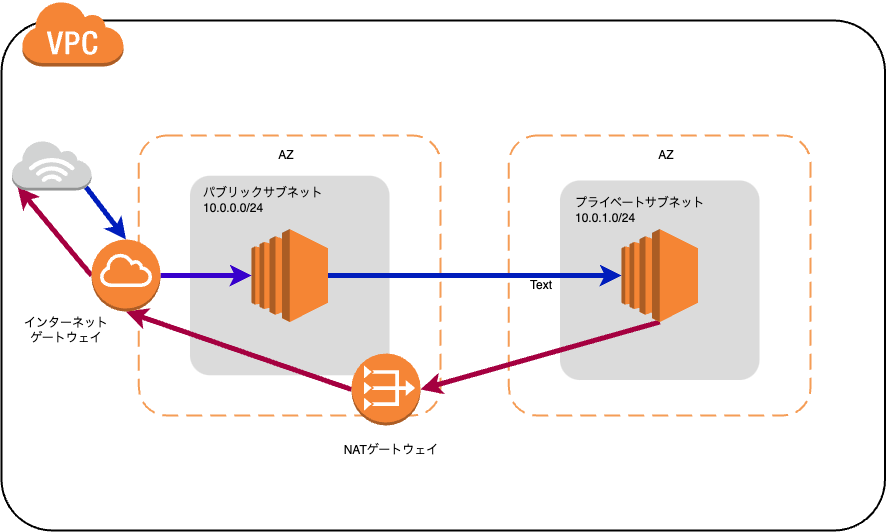

# VPC

AWS クラウドのネットワークからユーザー専用の領域を切り出すことが出来る仮想ネットワークサービス 
1 つの VPC に１つのサブネットが最小構成。単一サブネットが AZ の範囲に設定される。 
サブネットを追加することで複数 AZ 範囲に VPC を広げることが出来る。しかし、VPC はリージョンを超えることはできない 

- １リージョン内に５つまで設定可能（上限緩和可能）
- 任意の IP アドレスを範囲を選択して仮想ネットワークを構築
  - 最小サイズは/28
  - 最大サイズは/16
- VPC はプライベート IP アドレスによってネットワークレンジを設定
- サブネットの作成、ルートテーブルやネットワークゲートウェイの設定などにより、仮想ネットワーキング環境を完全に制御できる。
- 必要に応じてクラウド内外のネットワーク同志を接続したり、外部のネットワークと接続することが可能。

### 設定できないアドレス(CIDR が/24)

| ホストアドレス | 用途                           |
| -------------- | ------------------------------ |
| .0             | ネットワークアドレス           |
| .1             | VPC ルータ                     |
| .2             | Amazon が提供する DNS アドレス |
| .3             | AWS 側で予約されているアドレス |
| .255           | ブロードキャストアドレス       |

## デフォルト VPC

AWS アカウントを作成すると、自動的に各リージョンに１つずつデフォルト VPC とデフォルトサブネットが生成される。

## カスタム VPC の作成

VPC ウィザードを利用しない場合は、VPC を作成、サブネットを作成と１つずつ作成する。

1. VPC 作成
1. サブネット作成
1. インターネット経路を設定
1. VPC トラフィック許可の設定

## VPC ウィザード

視覚的にネットワーク構成を一度に作成することが可能

## サブネット

VPC あたり 200 個まで 

以下２種類

- パブリックサブネット
  - インターネットゲートウェイにルーティングされるサブネット
- プライベートサブネット
  - インターネットゲートウェイへのルートがないサブネット

## プライベートサブネットの外部アクセス

プライベートサブネット内のインスタンスにインターネットから接続するには踏み台サーバーが必要

## ゲートウェイの設定

VPC コンソールで作成・管理出来るゲートウェイは以下の通り

| ゲートウェイ                 | 説明                                                                                                                                                                                                   |
| ---------------------------- | ------------------------------------------------------------------------------------------------------------------------------------------------------------------------------------------------------ |
| インターネットゲートウェイ   | インターネットの出入り口 デフォルトゲートウェイとして利用されることが多い インターネットゲートウェイを VPC に必ず１つ設置する                                                                    |
| NAT ゲートウェイ             | プライベートサブネットのリソースからインターネットゲートへのトラフィックを可能にするためのゲートウェイ プライベートアドレスをパブリックアドレスに変換して、インターネットゲートウェイに連携させる。 |
| Egress-Only Internet Gateway | IPv6 向けのインターネットゲートウェイ IPv6 経由での VPC からインターネットへの送信を可能にし、インターネットからのインスタンスへの接続を防ぐ。                                                      |
| カスタマーゲートウェイ       | オンプレミスと接続時に使用 カスタマーゲートデバイスまたはソフトウェアアプリケーションに関数情報を AWS に提供                                                                                        |
| 仮想プライベートゲートウェイ | 仮想プライベートゲートウェイは、VPC トンネルの　 AmazonVPN 接続時に利用る                                                                                                                              |

## VPC における DNS の使用

VPC 内で起動したインスタンスがパブリック IP アドレスに対応する DNS ホスト名を取得するために設定が必要

| DNS               |                                                                                                                                                                                                                                                   |
| ----------------- | ------------------------------------------------------------------------------------------------------------------------------------------------------------------------------------------------------------------------------------------------- |
| enableDnsHostname | パブリック IP アドレスを持つインスタンスが、対応するパブリック DNS ホスト名を取得するかどうか示す  この属性が true で enableDnsSupport 属性も true の場合、VPC 内のインスタンスは DNS ホスト名を取得する                                    |
| enableDnsSupport  | DNS 解決がサポートされているかどうかを示す この属性が false の場合、route 53 Resolver サーバーが機能しない この属性が ture の場合、Amazon が提供する DNS サーバーへのクエリ、またはリザーブド IP アドレスネットワーク範へのクエリは成功する |
